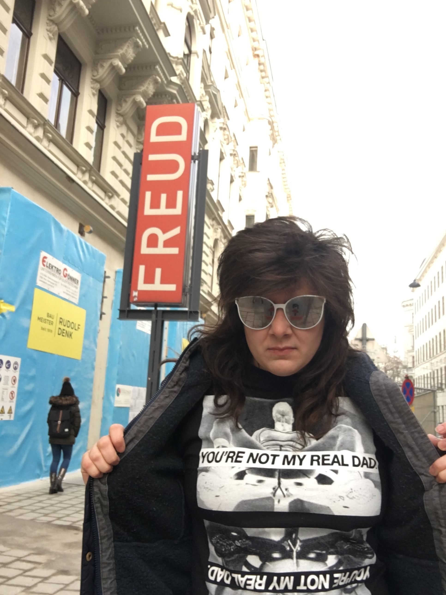

+++
title = "Performance Art"
menuImage = "Performance_Art.png"
weight = 5
menu = "main"
color = "turquoise"
imageDirectory = "/images/performance/"
layout = "narrow"
+++
# HELLO
Since grad school I've explained my art illustrates "problems and failures in modern society", which is a line I stole from Michael Hanenke's [Wikipedia](https://www.wikipedia.org/) page in [2010](https://en.wikipedia.org/wiki/2010_(disambiguation)).

[Email me](mailto:realfakenewyorker@gmail.com) if you want to talk.